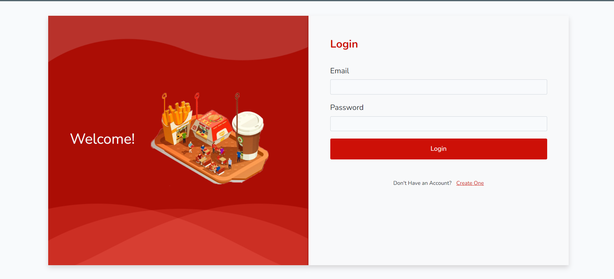
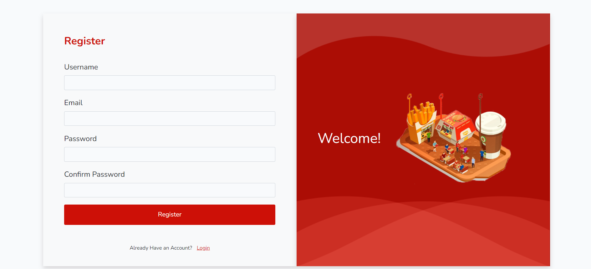
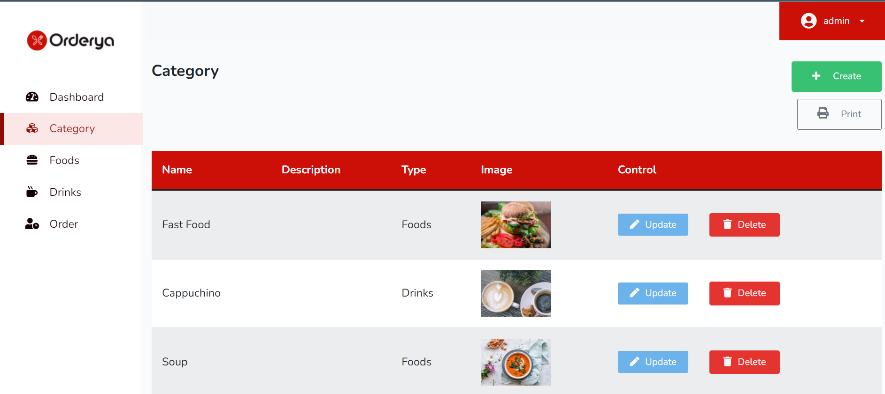
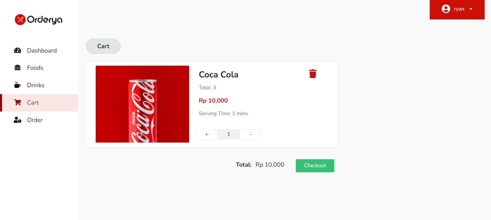
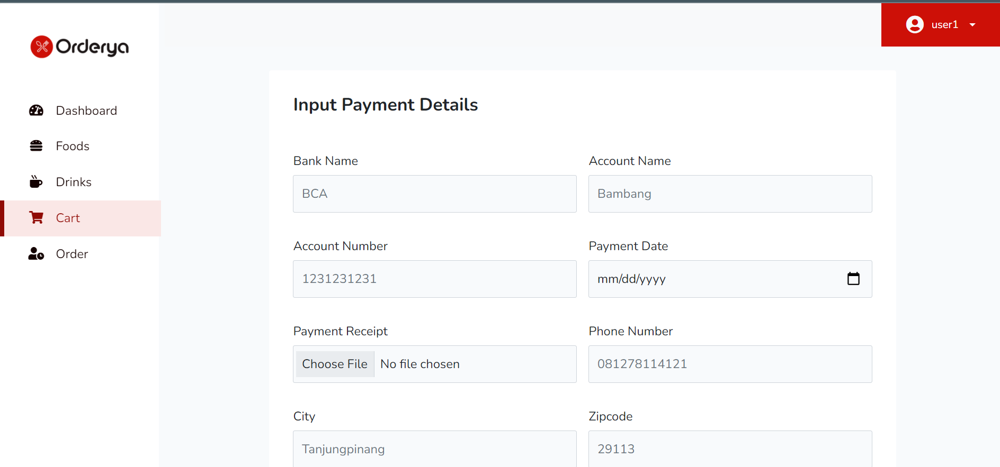
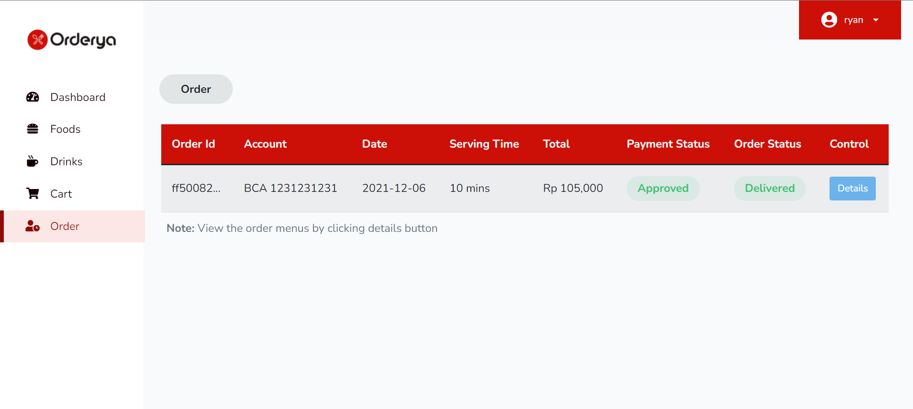
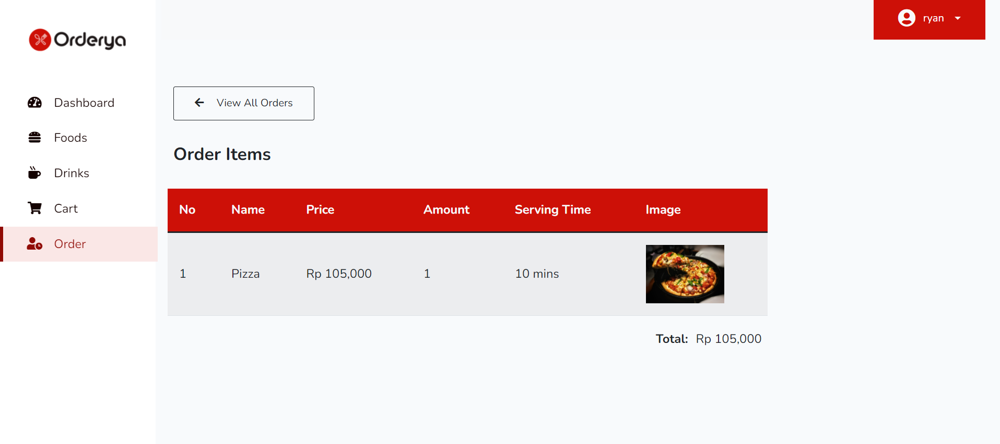

<h1>Orderya</h1>

## About Orderya

Orderya is a restaurant order management website where customer can order the menu by themselves from the system and admin can check the order as well as the payments.

## Technology Used

  

    

## Features

-   Login System With Authentication and Authorization
    
    

-   Admin

    -   Viewing order data in dashboard
        

    -   Perform CRUD operations
        

    -   View customer's order, order details , and payments
        
        

-   User

    -   View all category
        

    -   View all foods
        

    -   View foods added to cart
        

    -   Fill form for checkout
        

    -   View their order and order details
        
        
